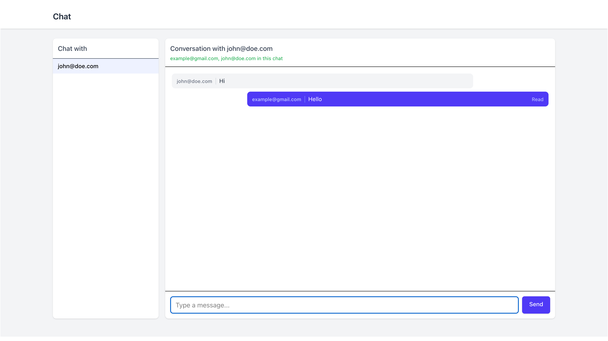

# Elixir Realtime Chat demo

**In-memory realtime chat demo** built with Phoenix LiveView and PubSub. No database — state lives in a supervised GenServer (ETS). Built to model the core mechanics of a realtime messaging backend using Phoenix primitives.

## What it is

A small chat product: two users open the app, pick each other, and chat. Messages, typing indicators, and read receipts work in real time. There is also a REST API and WebSocket API for the same data so you can drive it from Postman or another client.



## Features

- **Realtime messages** — Send via LiveView or REST/WebSocket; all subscribers see updates instantly.
- **Typing indicator** — "Alice is typing..." with a 2s TTL after last keystroke; cleared on send.
- **Read receipts** — Sent/Read per message; recipient marks read when they have the conversation open or receive a message.
- **Presence** — "X, Y in this chat" so you see who’s viewing the conversation.
- **Message ordering** — Per-conversation monotonic sequence so order is deterministic.

## Architecture

- **Conversations** are identified by a **topic** `user_id_1:user_id_2` (sorted). I intentionally avoided per-room processes to keep coordination simple; PubSub topics model rooms, while Store is the authoritative state holder. Each conversation uses a **PubSub topic** (`room:#{topic}`) plus a **Presence topic** (`room_presence:#{topic}`).
- **State** is owned by a single **GenServer** (`ChatApi.Store`): users, messages (with per-conversation `seq`), and read receipts in ETS. Store is under the app supervisor. I chose a single Store GenServer (instead of per-room processes) to keep the demo simple and ensure consistent sequencing; in a production system I'd likely partition by conversation or shard by topic for scalability.
- **Messages** are broadcast on `room:#{topic}`; LiveViews subscribe when you open a conversation. New messages and read receipts are plain PubSub messages.
- **Typing** is ephemeral: LiveView tracks presence with `typing: true` and broadcasts `{:typing, user_id, email, true|false}` on the same room topic; a 2s debounce clears "typing" when the user stops.
- **Ordering** uses a per-conversation sequence counter in Store (`seq`) so messages render in a deterministic order regardless of clock skew.

```
┌─────────────┐     PubSub "room:userA:userB"      ┌─────────────┐
│  LiveView   │◄──── messages, typing, receipts ──►│  LiveView   │
│  (User A)   │                                    │  (User B)   │
└──────┬──────┘                                    └──────┬──────┘
       │                                                  │
       │              ┌───────────────┐                   │
       └─────────────►│ ChatApi.Store │◄──────────────────┘
                      │ (GenServer)   │
                      │ ETS: users,   │
                      │ messages, seq,│
                      │ read receipts │
                      └───────────────┘
```

## How to run

```bash
mix setup
mix phx.server
```

Open **http://localhost:4000**. Enter an email to "log in" (creates or reuses a user). Pick another user from the sidebar and chat.

**Demo users (optional):** run once to create two users so you can open two browsers:

```bash
mix chat_api.seed   # creates john@doe.com, example@gmail.com
```

Then log in as each in two windows/tabs and chat between them.

## Deploy on Coolify

1. **Create a new resource** in Coolify → **Application** → deploy from your Git repo (or Dockerfile).
2. **Build** — Use the repo’s **Dockerfile** (no compose needed; the app is a single container).
3. **Environment variables** (required in Coolify’s env UI):
   - `SECRET_KEY_BASE` — Generate with: `mix phx.gen.secret`
   - `PHX_HOST` — Your public hostname (e.g. `chat.yourdomain.com`) so URL generation and cookies work behind the proxy.
   - `PORT` — Coolify usually sets this; the app defaults to `4000` if unset.
4. Coolify will build the image, run the container, and expose it via its reverse proxy (HTTPS). No database or extra services are required; state is in-memory in the container.

## What I learned

- **PubSub as the room** — No dedicated room GenServer; a topic per conversation and Store as the single source of truth kept the model simple and made it easy to add typing and read receipts as more message types on the same topic.
- **LiveView lifecycle** — Subscribing in `handle_params` when the selected user changes, and merging query params from the URI so `/chat?with=id` works on first load and after refresh.
- **Presence + explicit typing broadcast** — Presence gives "who’s here"; for typing we also broadcast `{:typing, ...}` on the room topic so the other LiveView reliably receives it without depending on presence_diff delivery.
- **Supervision** — Store is a worker under the app supervisor; if it crashes it restarts (in-memory state is lost).

## Production considerations

- **Persistence** — Persist messages to Postgres with indexed `(conversation_id, seq)` for pagination.
- **Scaling** — Partition/shard Store (e.g., per-conversation process or consistent hashing) to avoid a single bottleneck.
- **Auth** — Add authentication and authorization checks on conversation access.
- **Rate limiting** — Rate limit message send to prevent abuse.
- **Observability** — Add telemetry/metrics for message latency and PubSub fan-out.
- **Delivery** — Consider delivery guarantees (at-least-once vs at-most-once) and idempotency keys for production reliability.

---

## REST API (Postman)

| Method | Endpoint | Description |
|--------|----------|-------------|
| POST | /api/users | Create user (body: `{"email":"..."}`) |
| POST | /api/messages | Send message (from_user_id, to_user_id, body) |
| GET | /api/conversations?user_id=&with_user_id= | Conversation history |

## WebSocket

Connect with a valid `user_id`:  
`ws://localhost:4000/socket/websocket?vsn=2.0.0&user_id=<user_id>`

Join room: `room:USER_A_ID:USER_B_ID` (IDs sorted). Send event `new_message` with `to_user_id` and `body`. Server pushes `new_message` and `presence_diff` to subscribers.

## Tests

```bash
mix test
```

Covers: Store (conversation ordering by seq, read receipts), LiveView redirect when session is missing or invalid.

---

Data is in-memory only; restarting the server clears all state.
